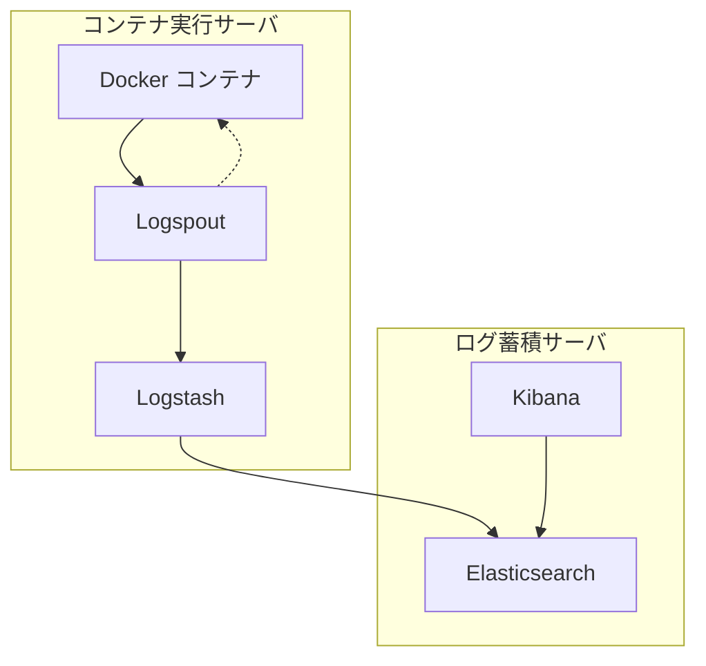

Docker コンテナのログはコンテナが終了すると閲覧できなくなります。  
障害が発生したときに後からログを確認したいときに、そのコンテナが異常終了していると見れないケースがあるので、外部にログを投げてそれを閲覧できる仕組みが必要でした。  
[Logspout](https://github.com/gliderlabs/logspout) + [Logstash](https://www.elastic.co/jp/logstash/) + [Elasticsearch](https://www.elastic.co/jp/elasticsearch/) + [Kibana](https://www.elastic.co/jp/kibana/) で実施します。

最初は Docker Compose のロギングドライバ + [Fluentd](https://www.fluentd.org/) + Elasticsearch + Kibana で作ることを考えていました。  
しかし、ログサーバが死んでいたら起動しなかったり、すべての Compose 設定ファイルに `log-driver` 設定をするのが面倒と思っていたなかで、`logspout` というソフトウェアを見つけたので利用しました。

## 仕様

1台のログ蓄積サーバと、2台のコンテナ実行サーバで構成します。  
コンテナ実行サーバには複数の Docker コンテナがあります。

Logspout を使用して、Docker コンテナ群からログを取得します。  
取得したログは各コンテナ実行サーバで動作する Logstash へ一旦転送します。  
その後、Logstash からログ蓄積サーバで動作する Elasticsearch に転送します。  
閲覧時、ユーザは Kibana Web GUI にアクセスする。この際、Kibana は Elasticsearch のデータを参照します。



## 環境

コンテナ実行サーバの設定は一部ホスト名の設定を除き、同一の環境・設定になっています。

Logspout, Logstash と Elasticsearch, Kibana は Docker Compose で構成します。

- ログ蓄積サーバ (ホスト名: `orange`)
  - Raspberry Pi 4 model B
  - Ubuntu 22.04.2
  - Docker 23.0.5 (Build bc4487a)
  - Docker Compose v2.17.3
  - Elasticsearch 7.13.1
  - Kibana 7.13.1
- コンテナ実行サーバ (ホスト名: `tomapi`, `nuts`)
  - `tomapi`
    - Raspberry Pi 4 model B
    - Raspberry Pi OS 64 bit (Bullseye)
  - `nuts`
    - Ubuntu 22.04.2
  - Docker 23.0.5 (Build bc4487a)
  - Docker Compose v2.17.3
  - Logspout v3.2.14
  - Logstash 8.7.1

## 作業

1. ログ蓄積サーバで Elasticsearch と Kibana を立ち上げ
2. コンテナ実行サーバで Logspout と Logstash を立ち上げる
3. ログが蓄積されていることを確認
4. より良いログの閲覧・ダッシュボードの活用

### 1. ログ蓄積サーバで Elasticsearch と Kibana を立ち上げ

以下の Gist をログ蓄積サーバで `compose.yaml` として保存します。

@[gist](https://gist.github.com/book000/2358c7db69e34442051c268a34245830)

以下のコマンドを実行してダウンロードしても構いません。

```bash
wget https://gist.github.com/book000/2358c7db69e34442051c268a34245830/raw/compose.yaml
```

Elasticsearch のデータディレクトリとして `es-data` ディレクトリを指定しています。  
権限の関係で、そのままでは上手く動作しない（Permission denied）のでとりあえず rwxrwxrwx (777) を設定しておくことにします。[^1]  
以下を実行します。

```bash
mkdir es-data
chmod 777 es-data
```

その後、Docker Compose で立ち上げます。

```bash
docker compose up --build -d
```

:::message
`compose.yaml` では、Elasticsearch と Kibana を `docker.elastic.co` でホストされているイメージを使用して立ち上げています。  
特記すべき事項を以下にまとめておきます。

- `elasticsearch` の環境変数 `xpack.security.enabled`: セキュアな通信を有効にする設定を無効にしています。自宅内 LAN で動作することを想定していることと、設定簡略化のために無効にしていますが本来は適切なセキュリティ設定が必要です。具体的な設定方法は [公式ドキュメント](https://www.elastic.co/jp/blog/getting-started-with-security) を参照ください。
- `elasticsearch` の `healthcheck`: `/_cluster/health` は JSON でクラスタの状態が返ります。これを参照し、`red` ステータスでないことを確認しています。
- `kibana` の `elasticsearch` 参照設定: 本来、`ELASTICSEARCH_HOSTS` 環境変数を用いて kibana に elasticsearch への接続情報を渡す必要があります。しかし、Docker イメージではデフォルトで `http://elasticsearch:9200` が指定されているため[^2]、今回の環境では設定する必要はありません。
:::

### 2. コンテナ実行サーバで Logspout と Logstash を立ち上げる

以下の Gist をログ蓄積サーバでそれぞれのファイルを保存します。

@[gist](https://gist.github.com/book000/9471df754b741c712eb9be8f6af5c18f)

以下のコマンドを実行してダウンロードしても構いません。

```bash
wget https://gist.github.com/book000/9471df754b741c712eb9be8f6af5c18f/raw/compose.yaml
wget https://gist.github.com/book000/9471df754b741c712eb9be8f6af5c18f/raw/logstash.conf
wget https://gist.github.com/book000/9471df754b741c712eb9be8f6af5c18f/raw/logstash.Dockerfile
```

保存後、以下の項目を書き換えてください。

- `compose.yaml` の 19 行目: `<HOSTNAME>` を任意のホスト名に変更

その後、Docker Compose で立ち上げます。

```bash
docker compose up --build -d
```

:::message
`compose.yaml` では、`gliderlabs/logspout` と `netcat` をインストールした Logstash を使用して立ち上げています。


:::

### 3. ログが蓄積されていることを確認

### 4. より良いログの閲覧・ダッシュボードの活用

[^1]: 必ずしも良い対応ではないので、適切な設定をどのようにするべきか教えてください…。
[^2]: 参照: [公式ドキュメント](https://www.elastic.co/guide/en/kibana/current/docker.html#docker-defaults)
