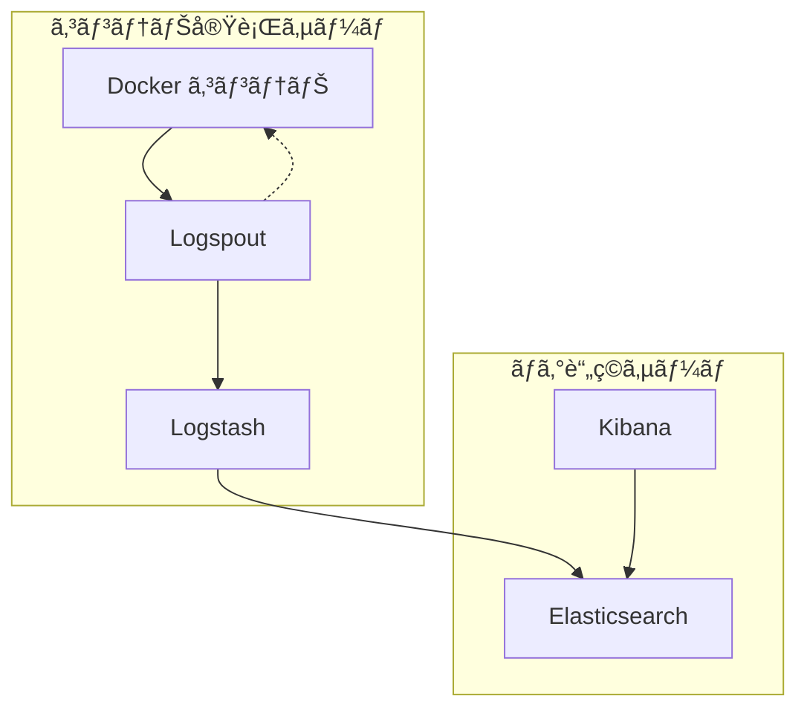

Docker コンテナã®ãƒ­ã‚°ã¯ã‚³ãƒ³ãƒ†ãƒŠãŒçµ‚了ã™ã‚‹ã¨é–²è¦§ã§ããªããªã‚Šã¾ã™ã€‚  
障害ãŒç™ºç”Ÿã—ãŸã¨ãã«å¾Œã‹ã‚‰ãƒ­ã‚°ã‚’確èªã—ãŸã„ã¨ãã«ã€ãã®ã‚³ãƒ³ãƒ†ãƒŠãŒç•°å¸¸çµ‚了ã—ã¦ã„ã‚‹ã¨è¦‹ã‚‰ã‚Œãªã„ケースãŒã‚ã‚‹ã®ã§ã€å¤–部ã«ãƒ­ã‚°ã‚’投ã’ã¦ãれを閲覧ã§ãる仕組ã¿ãŒå¿…è¦ã§ã—ãŸã€‚  
[Logspout](https://github.com/gliderlabs/logspout) + [Logstash](https://www.elastic.co/jp/logstash/) + [Elasticsearch](https://www.elastic.co/jp/elasticsearch/) + [Kibana](https://www.elastic.co/jp/kibana/) ã§å®Ÿæ–½ã—ã¾ã™ã€‚

最åˆã¯ Docker Compose ã®ãƒ­ã‚®ãƒ³ã‚°ãƒ‰ãƒ©ã‚¤ãƒ + [Fluentd](https://www.fluentd.org/) + Elasticsearch + Kibana ã§ä½œã‚‹ã“ã¨ã‚’考ãˆã¦ã„ã¾ã—ãŸã€‚  
ã—ã‹ã—ã€ãƒ­ã‚°ã‚µãƒ¼ãƒãŒæ­»ã‚“ã§ã„ãŸã‚‰èµ·å‹•ã—ãªã‹ã£ãŸã‚Šã€ã™ã¹ã¦ã® Compose 設定ファイル㫠`log-driver` 設定をã™ã‚‹ã®ãŒé¢å€’ã¨æ€ã£ã¦ã„ãŸãªã‹ã§ã€`logspout` ã¨ã„ã†ã‚½ãƒ•ãƒˆã‚¦ã‚§ã‚¢ã‚’見ã¤ã‘ãŸã®ã§åˆ©ç”¨ã—ã¾ã—ãŸã€‚

## 仕様

1 å°ã®ãƒ­ã‚°è“„ç©ã‚µãƒ¼ãƒã¨ã€2 å°ã®ã‚³ãƒ³ãƒ†ãƒŠå®Ÿè¡Œã‚µãƒ¼ãƒã§æ§‹æˆã—ã¾ã™ã€‚  
コンテナ実行サーãƒã«ã¯è¤‡æ•°ã® Docker コンテナãŒã‚ã‚Šã¾ã™ã€‚

Logspout を使用ã—ã¦ã€Docker コンテナ群ã‹ã‚‰ãƒ­ã‚°ã‚’å–å¾—ã—ã¾ã™ã€‚  
å–å¾—ã—ãŸãƒ­ã‚°ã¯å„コンテナ実行サーãƒã§å‹•ä½œã™ã‚‹ Logstash ã¸ã„ã£ãŸã‚“転é€ã—ã¾ã™ã€‚  
ãã®å¾Œã€Logstash ã‹ã‚‰ãƒ­ã‚°è“„ç©ã‚µãƒ¼ãƒã§å‹•ä½œã™ã‚‹ Elasticsearch ã«è»¢é€ã—ã¾ã™ã€‚  
閲覧時ã€ãƒ¦ãƒ¼ã‚¶ãƒ¼ã¯ Kibana Web GUI ã«ã‚¢ã‚¯ã‚»ã‚¹ã—ã¾ã™ã€‚ã“ã®éš›ã€Kibana 㯠Elasticsearch ã®ãƒ‡ãƒ¼ã‚¿ã‚’å‚ç…§ã—ã¾ã™ã€‚


```mermaid
flowchart TD
  Container[Docker コンテナ]
  Logspout
  Logstash
  Elasticsearch
  Kibana

  subgraph ContainerServer[コンテナ実行サーãƒ]
    Logspout -.-> Container
    Container --> Logspout
    Logspout --> Logstash
  end

  subgraph LogServer[ログ蓄ç©ã‚µãƒ¼ãƒ]
    Logstash --> Elasticsearch
    Kibana --> Elasticsearch
  end
```

## 環境

コンテナ実行サーãƒã®è¨­å®šã¯ä¸€éƒ¨ãƒ›ã‚¹ãƒˆåã®è¨­å®šã‚’除ãã€åŒä¸€ã®ç’°å¢ƒãƒ»è¨­å®šã«ãªã£ã¦ã„ã¾ã™ã€‚

Logspout, Logstash 㨠Elasticsearch, Kibana 㯠Docker Compose ã§æ§‹æˆã—ã¾ã™ã€‚

- ログ蓄ç©ã‚µãƒ¼ãƒ (ホストå: `orange`)
  - Raspberry Pi 4 model B
  - Ubuntu 22.04.2
  - Docker 23.0.5 (Build bc4487a)
  - Docker Compose v2.17.3
  - Elasticsearch 7.13.1
  - Kibana 7.13.1
- コンテナ実行サーム(ホストå: `tomapi`, `nuts`)
  - `tomapi`
    - Raspberry Pi 4 model B
    - Raspberry Pi OS 64 bit (Bullseye)
  - `nuts`
    - Ubuntu 22.04.2
  - Docker 23.0.5 (Build bc4487a)
  - Docker Compose v2.17.3
  - Logspout v3.2.14
  - Logstash 8.7.1

## 作業

1. ログ蓄ç©ã‚µãƒ¼ãƒã§ Elasticsearch 㨠Kibana ã‚’ç«‹ã¡ä¸Šã’
2. コンテナ実行サーãƒã§ Logspout 㨠Logstash ã‚’ç«‹ã¡ä¸Šã’ã‚‹
3. ログãŒè“„ç©ã•ã‚Œã¦ã„ã‚‹ã“ã¨ã‚’確èª
4. より良ã„ログã®é–²è¦§ãƒ»ãƒ€ãƒƒã‚·ãƒ¥ãƒœãƒ¼ãƒ‰ã®æ´»ç”¨

### 1. ログ蓄ç©ã‚µãƒ¼ãƒã§ Elasticsearch 㨠Kibana ã‚’ç«‹ã¡ä¸Šã’

以下㮠Gist をログ蓄ç©ã‚µãƒ¼ãƒã§ `compose.yaml` ã¨ã—ã¦ä¿å­˜ã—ã¾ã™ã€‚

@[gist](https://gist.github.com/book000/2358c7db69e34442051c268a34245830)

以下ã®ã‚³ãƒãƒ³ãƒ‰ã‚’実行ã—ã¦ãƒ€ã‚¦ãƒ³ãƒ­ãƒ¼ãƒ‰ã—ã¦ã‚‚構ã„ã¾ã›ã‚“。

```bash
wget https://gist.github.com/book000/2358c7db69e34442051c268a34245830/raw/compose.yaml
```

Elasticsearch ã®ãƒ‡ãƒ¼ã‚¿ãƒ‡ã‚£ãƒ¬ã‚¯ãƒˆãƒªã¨ã—㦠`es-data` ディレクトリを指定ã—ã¦ã„ã¾ã™ã€‚  
権é™ã®é–¢ä¿‚ã§ã€ãã®ã¾ã¾ã§ã¯ä¸Šæ‰‹ã動作ã—ãªã„（Permission denied）ã®ã§ã¨ã‚Šã‚ãˆãš rwxrwxrwx (777) を設定ã—ã¦ãŠãã“ã¨ã«ã—ã¾ã™ã€‚[^1]  
以下を実行ã—ã¾ã™ã€‚

```bash
mkdir es-data
chmod 777 es-data
```

ãã®å¾Œã€Docker Compose ã§ç«‹ã¡ä¸Šã’ã¾ã™ã€‚

```bash
docker compose up --build -d
```

:::message
`compose.yaml` ã§ã¯ã€Elasticsearch 㨠Kibana ã‚’ `docker.elastic.co` ã§ãƒ›ã‚¹ãƒˆã•ã‚Œã¦ã„るイメージを使用ã—ã¦ç«‹ã¡ä¸Šã’ã¦ã„ã¾ã™ã€‚  
特記ã™ã¹ã事項を以下ã«ã¾ã¨ã‚ã¦ãŠãã¾ã™ã€‚

- `elasticsearch` ã®ç’°å¢ƒå¤‰æ•° `xpack.security.enabled`: セキュアãªé€šä¿¡ã‚’有効ã«ã™ã‚‹è¨­å®šã‚’無効ã«ã—ã¦ã„ã¾ã™ã€‚自宅内 LAN ã§å‹•ä½œã™ã‚‹ã“ã¨ã‚’想定ã—ã¦ã„ã‚‹ã“ã¨ã¨ã€è¨­å®šç°¡ç•¥åŒ–ã®ãŸã‚ã«ç„¡åŠ¹ã«ã—ã¦ã„ã¾ã™ãŒæœ¬æ¥ã¯é©åˆ‡ãªã‚»ã‚­ãƒ¥ãƒªãƒ†ã‚£è¨­å®šãŒå¿…è¦ã§ã™ã€‚具体的ãªè¨­å®šæ–¹æ³•ã¯ [å…¬å¼ãƒ‰ã‚­ãƒ¥ãƒ¡ãƒ³ãƒˆ](https://www.elastic.co/jp/blog/getting-started-with-security) ã‚’å‚ç…§ãã ã•ã„。
- `elasticsearch` ã® `healthcheck`: `/_cluster/health` 㯠JSON ã§ã‚¯ãƒ©ã‚¹ã‚¿ã®çŠ¶æ…‹ãŒè¿”ã‚Šã¾ã™ã€‚ã“れをå‚ç…§ã—ã€`red` ステータスã§ãªã„ã“ã¨ã‚’確èªã—ã¦ã„ã¾ã™ã€‚
- `kibana` ã® `elasticsearch` å‚照設定: 本æ¥ã€`ELASTICSEARCH_HOSTS` 環境変数を用ã„㦠kibana ã« elasticsearch ã¸ã®æ¥ç¶šæƒ…報を渡ã™å¿…è¦ãŒã‚ã‚Šã¾ã™ã€‚ã—ã‹ã—ã€Docker イメージã§ã¯ãƒ‡ãƒ•ã‚©ãƒ«ãƒˆã§ `http://elasticsearch:9200` ãŒæŒ‡å®šã•ã‚Œã¦ã„ã‚‹ãŸã‚[^2]ã€ä»Šå›ã®ç’°å¢ƒã§ã¯è¨­å®šã™ã‚‹å¿…è¦ã¯ã‚ã‚Šã¾ã›ã‚“。
:::

### 2. コンテナ実行サーãƒã§ Logspout 㨠Logstash ã‚’ç«‹ã¡ä¸Šã’ã‚‹

以下㮠Gist をコンテナ実行サーãƒã§ãã‚Œãã‚Œã®ãƒ•ã‚¡ã‚¤ãƒ«ã‚’ä¿å­˜ã—ã¾ã™ã€‚

@[gist](https://gist.github.com/book000/9471df754b741c712eb9be8f6af5c18f)

以下ã®ã‚³ãƒãƒ³ãƒ‰ã‚’実行ã—ã¦ãƒ€ã‚¦ãƒ³ãƒ­ãƒ¼ãƒ‰ã—ã¦ã‚‚構ã„ã¾ã›ã‚“。

```bash
wget https://gist.github.com/book000/9471df754b741c712eb9be8f6af5c18f/raw/compose.yaml
wget https://gist.github.com/book000/9471df754b741c712eb9be8f6af5c18f/raw/logstash.conf
wget https://gist.github.com/book000/9471df754b741c712eb9be8f6af5c18f/raw/logstash.Dockerfile
```

ä¿å­˜å¾Œã€ä»¥ä¸‹ã®é …目を書ãæ›ãˆã¦ãã ã•ã„。

- `compose.yaml` ã® 19 行目: `<HOSTNAME>` ã‚’ä»»æ„ã®ãƒ›ã‚¹ãƒˆåã«å¤‰æ›´
- `logstash.conf` ã® 47 行目: `<IP-ADDRESS>` をログ蓄ç©ã‚µãƒ¼ãƒã® IP アドレスã«å¤‰æ›´

ãã®å¾Œã€Docker Compose ã§ç«‹ã¡ä¸Šã’ã¾ã™ã€‚

```bash
docker compose up --build -d
```

:::message
`compose.yaml` ã§ã¯ã€`gliderlabs/logspout` 㨠`netcat` をインストールã—㟠Logstash を使用ã—ã¦ç«‹ã¡ä¸Šã’ã¦ã„ã¾ã™ã€‚
:::

### 3. ログãŒè“„ç©ã•ã‚Œã¦ã„ã‚‹ã“ã¨ã‚’確èª

ログ蓄ç©ã‚µãƒ¼ãƒã® 5601 番ãƒãƒ¼ãƒˆã¸ãƒ–ラウザã§ã‚¢ã‚¯ã‚»ã‚¹ã—ã€ä»¥ä¸‹ã®è¨­å®šã‚’ã—ã¾ã™ã€‚

1. `Select your space` ã¨å‡ºã¦ããŸã‚‰ `Default` ã‚’é¸æŠ
2. `Start by adding your data` ã¨å‡ºã¦ããŸã‚‰ã€`Add data` をクリック
3. Logstash ã«ã‚ˆã£ã¦ãƒ‡ãƒ¼ã‚¿ãŒé€å—ä¿¡ã•ã‚Œã¦ã„ã‚‹ã¯ãšãªã®ã§ã€å·¦ä¸Šä¸‰æœ¬ç·šã§ã‚µã‚¤ãƒ‰ãƒãƒ¼ã‚’é–‹ãã€`Analytics` ã® `Discover` ã«ã‚¢ã‚¯ã‚»ã‚¹
4. `You have data in Elasticsearch. Now, create an index pattern.` ã¨è¡¨ç¤ºã•ã‚ŒãŸã‚‰ã€`Create index pattern` をクリック  
   ã“ã“㧠`Ready to try Kibana? First, you need data.` ã¨ã„ã†ç”»é¢ãŒå‡ºã¦ããŸã‚‰ã€ãƒ­ã‚°ãƒ‡ãƒ¼ã‚¿ãŒå—ä¿¡ã§ãã¦ã„ãªã„。
5. `Step 1 of 2: Define an index pattern` ã«ã¦ã€`Index pattern name` ã« `logs-*` ã¨å…¥åŠ›ã€`Next step` をクリック
6. `Step 2 of 2: Configure settings` ã«ã¦ã€`Time field` ã« `@timestamp` ãŒé¸æŠã•ã‚Œã¦ã„ã‚‹ã“ã¨ã‚’確èªã€‚`Create index pattern` をクリック
7. å†åº¦ã€å·¦ä¸Šä¸‰æœ¬ç·šã§ã‚µã‚¤ãƒ‰ãƒãƒ¼ã‚’é–‹ãã€`Analytics` ã® `Discover` ã«ã‚¢ã‚¯ã‚»ã‚¹
8. コンテナ実行サーãƒã®ãƒ­ã‚°ãŒç¢ºèªã§ãれ㰠OK

| 3 | 4 |
| :-: | :-: |
|  |  |

### 4. より良ã„ログã®é–²è¦§ãƒ»ãƒ€ãƒƒã‚·ãƒ¥ãƒœãƒ¼ãƒ‰ã®æ´»ç”¨

左上三本線ã§ã‚µã‚¤ãƒ‰ãƒãƒ¼ã‚’é–‹ãã€`Analytics` ã® `Dashboard` ã‹ã‚‰ã€ãƒ€ãƒƒã‚·ãƒ¥ãƒœãƒ¼ãƒ‰ã‚’作æˆã§ãã¾ã™ã€‚  
複数ã®ã‚µãƒ¼ãƒã‹ã‚‰ãƒ­ã‚°ã‚’å—ä¿¡ã™ã‚‹ãªã‚‰ã‚µãƒ¼ãƒã”ã¨ã®ãƒ¬ã‚³ãƒ¼ãƒ‰ã‚°ãƒ©ãƒ•ã‚„ã€ã‚³ãƒ³ãƒ†ãƒŠã”ã¨ã®ãƒ¬ã‚³ãƒ¼ãƒ‰ã‚°ãƒ©ãƒ•ã‚’作ã£ã¦ãŠãã¨æœ‰ç”¨ã‹ã¨æ€ã„ã¾ã™ã€‚


ã¾ãŸã€ãƒªã‚¢ãƒ«ã‚¿ã‚¤ãƒ ã§ãƒ­ã‚°ã‚’確èªã—ãŸã„å ´åˆã¯ã€å·¦ä¸Šä¸‰æœ¬ç·šã§ã‚µã‚¤ãƒ‰ãƒãƒ¼ã‚’é–‹ãã€`Observability` ã® `Logs` ã‚’é–‹ã `Stream live` を有効ã«ã™ã‚‹ã¨ç¢ºèªã§ãã¾ã™ã€‚


[^1]: å¿…ãšã—も良ã„対応ã§ã¯ãªã„ã®ã§ã€é©åˆ‡ãªè¨­å®šã‚’ã©ã®ã‚ˆã†ã«ã™ã‚‹ã¹ãã‹æ•™ãˆã¦ãã ã•ã„…。
[^2]: å‚ç…§: [å…¬å¼ãƒ‰ã‚­ãƒ¥ãƒ¡ãƒ³ãƒˆ](https://www.elastic.co/guide/en/kibana/current/docker.html#docker-defaults)
