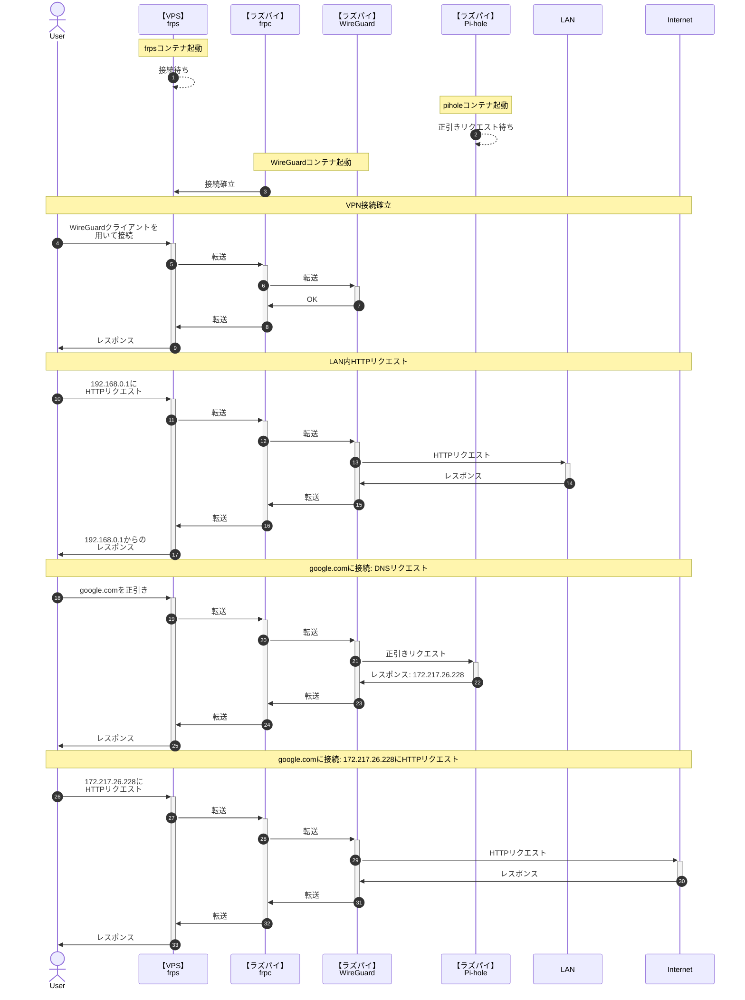

Raspberry Pi 4 model B で VPN アプリケーションである [WireGuard](https://www.wireguard.com/) を立て、[ConoHa VPS](https://www.conoha.jp/vps/) を経由して VPN 環境を構築します。

**自宅ルータのポートを開けずに** 自宅外から自宅内のサーバやパソコンにアクセスしたい、フリー Wi-Fi でもある程度安全に通信できる環境を作りたいと思い構築しています。

:::message alert
もともと [自分のメモサイト](https://memo.tomacheese.com) に上げようと思っていた内容を途中で持ってきたので、わかりにくい部分があったらすみません。  
また筆者には独学で学んだある程度のネットワーク知識しかなく、執筆した内容が正しいとは限りませんので他の記事や書籍もご覧ください。

WireGuard の利点や特徴はこの記事では解説しておりませんので、他の記事をご覧ください。
:::

## 期待する結果

最終的に、以下のように動作するよう構成します。



## 環境

Raspberry Pi と VPS 間のポートフォワーディングに [fatedier/frp](https://github.com/fatedier/frp) を利用します。  
そのうえで、Docker Hub にあるもののうち **ユーザー数がある程度いて**、**GitHub Actions などで fatedier/frp のアップデートに追従しているもの** として [snowdreamtech/frp](https://github.com/snowdreamtech/frp) を選定しています。

:::message alert
Pi-hole と frp の利用には Docker を利用していますが、WireGuard は Docker 内で動作させません。また、PiVPN を利用しません。  
[linuxserver/wireguard](https://hub.docker.com/r/linuxserver/wireguard) を試したのですが、接続後 1 分程経過したタイミングでコンテナ内から LAN への通信がタイムアウトするようになりやめました。  
PiVPN を利用しない理由は途中のネットワークデバイス選択画面で Docker ネットワークが大量に表示され進めなくなったからです。

Raspberry Pi のブートストレージとして SD カードを利用している場合、SD カード故障による設定および鍵の紛失を防ぐため `/etc/wireguard` を HDD など別のストレージへのシンボリックリンクにするなど対策を取ってください。この記事では解説しません。
:::

もちろん、frp や Pi-hole を Docker で構築せずホスト OS にインストールしてもかまいません。  
WireGuard では Peer to Peer で双方がサーバにもクライアントにもなりうるので、ピア（Peer）と書くのが正しいのですがこの記事ではっきりとサーバ・クライアントが存在するので、「クライアント」と表記します。

- Raspberry Pi 4 model B
  - Raspberry Pi OS 64bit (Bullseye)
  - WireGuard 1.0.20210223-1
  - [snowdreamtech/frps](https://hub.docker.com/r/snowdreamtech/frps) 0.47.0
  - [pi-hole/pi-hole](https://hub.docker.com/r/pi-hole/pi-hole) 2023.02.2
  - Ethernet の NIC として `eth0` を利用
  - 各クライアントに割り振る IP として `172.16.0.x` を使用
  - WireGuard のサーバ IP として `172.16.0.254` を使用
- ConoHa VPS
  - 512 MB プラン
  - Ubuntu 20.04.5 LTS
  - [snowdreamtech/frpc](https://hub.docker.com/r/snowdreamtech/frpc) 0.47.0
- iOS Client Device
  - iPhone SE 第 3 世代: iOS 16.3.1
  - iPad Pro 第 3 世代: iPad OS 16.3.1
  - WireGuard 1.0.16
- Android Client Device
  - Google Pixel 6a: Android 13
  - WireGuard 1.0.20220516
  - Tasker 6.0.10
- Windows Client Device
  - Windows 10 22H2 Build 19045.2604
  - WireGuard 0.5.3

## 作業

記事の趣旨から外れるので Pi-hole の構築を一番最後にしていますが、WireGuard に DNS を設定する関係上 1 と 2 の間に作業したほうが良いかと思われます。

1. frps の構築
2. WireGuard のインストール
3. frpc の構築
4. Pi-hole の構築

### 1. frps の構築

まず始めに、VPS 側の frp サーバソフトウェアである frps の構築作業をします。

VPS 上の任意の場所に以下の `compose.yaml` を作成します。

```yaml:compose.yaml
services:
  frps:
    image: snowdreamtech/frps
    container_name: frps
    volumes:
      - ./frps.ini:/etc/frp/frps.ini
    ports:
      - 7000:7000
      - 51820:51820/udp
    restart: always
```

その後、`compose.yaml` を置いた同じディレクトリに `frps.ini` を作成し以下を設定します。

```ini:frps.ini
[common]
bind_port = 7000
token = "任意の文字列"
```

`token` はポートフォワーディング時の認証トークンとなるので、固有のある程度長い推測不能な文字列にしてください。

設定を終えたら、`docker compose up --build -d` で立ち上げます。  
`7000` ポートの開放も忘れずに。

:::message
最小のコード量で動作するように書いているので、`7000` 番ポート以外への変更作業や frps のダッシュボードの設定などは記述していません。必要に応じて実施してください。
:::

### 2. WireGuard のインストール

VPN サーバとなる WireGuard を Raspberry Pi 4 model B にインストールします。

WireGuard のインストールでは、以下の手順を踏んでいきます。

1. `sysctl` の設定
2. APT で WireGuard をインストール
3. サーバサイド鍵ペアの作成
4. WireGuard の設定ファイル作成
5. クライアントに配布する接続設定ファイルの作成
6. WireGuard のクライアント設定を更新
7. WireGuard の起動

このうち、5, 6, 7 はクライアントを追加するごとに実施するのでシェルスクリプトで再利用可能にします。（`クライアント追加用のシェルスクリプト作成` にセクションをまとめます）

#### sysctl の設定

追加設定をしない限り、異なる NIC 間でのパケットのやりとりができません。WireGuard は `wg0` などの NIC を追加するので、これと `eth0` 間でパケット転送ができない場合 VPN をつないでも LAN ネットワークやインターネットと通信できません。  
（という理解なのですが、間違ってたらすみません）

というわけで、IP 転送（フォワーディング）を有効にするため sysctl を編集します。  
お好みのエディタで `/etc/sysctl.conf` を開き、末尾に以下を追記し保存します。

```ini:/etc/sysctl.conf
net.ipv4.ip_forward=1
```

すでに `net.ipv4.ip_forward` に関する記述がある場合は当該行をコメントアウトするなどしてください。

その後、編集した内容を反映するため以下のコマンドを実行します。

```shell
sudo sysctl -p
```

#### APT で WireGuard をインストール

以下のコマンドを実行し、WireGuard をインストールします。

```shell
sudo apt update
sudo apt install wireguard
```

クライアントに接続設定を追加する際、QR コードで読み込めるようにする場合は `qrencode` もインストールしておきましょう。

```shell
sudo apt install qrencode
```

#### サーバサイド鍵ペアの作成

サーバに保管する鍵ペア（秘密鍵と公開鍵）を作成します。

:::message
この記事では意図的に「サーバ」や「クライアント」など親子関係を意味する言葉を利用しているので余計にわかりにくいのですが、WireGuard は Peer to Peer なので双方を認証するために双方それぞれで公開鍵・秘密鍵を生成し双方の相手に公開鍵を渡す必要があります。
:::

以下のコマンドで作成します。作成した鍵は `/etc/wireguard/server-*.key` に保存し、所有者のみ読み書き可にします。

```shell
sudo wg genkey | sudo tee /etc/wireguard/server-private.key
sudo cat /etc/wireguard/server-private.key | wg pubkey | sudo tee /etc/wireguard/server-public.key
sudo chmod -v 600 /etc/wireguard/server-*.key
```

#### WireGuard の設定ファイル作成

WireGuard の設定ファイルを `/etc/wireguard/wg0.conf` に作成します。

```shell
cat << EOF | sudo tee /etc/wireguard/wg0.conf
[Interface]
Address = 172.16.0.254
ListenPort = 51820
PrivateKey = $(sudo cat /etc/wireguard/server-private.key)
PostUp = iptables -A FORWARD -i %i -j ACCEPT; iptables -A FORWARD -o %i -j ACCEPT; iptables -t nat -A POSTROUTING -o eth+ -j MASQUERADE
PostDown = iptables -D FORWARD -i %i -j ACCEPT; iptables -D FORWARD -o %i -j ACCEPT; iptables -t nat -D POSTROUTING -o eth+ -j MASQUERADE
EOF
```

`%i` には WireGuard の NIC 名が自動で置き換わります。この場合は `wg0` です。

#### クライアント追加用のシェルスクリプト作成

クライアントの鍵ペア（秘密鍵と公開鍵）を作成します。また、セキュリティ向上を目的に事前共有鍵（PSK, Pre-Shared Key）も作成します。

:::message
事前共有鍵については、オプションではありますがこれがあることにより将来的に量子コンピュータが実用化された場合に、公開鍵暗号が解かれても事前共有鍵によって暗号化されているので問題ない…という点で「セキュリティ向上」が見込めるようです。
:::

作成にあたり、この作業はクライアントを追加するごとに実施するのでシェルスクリプトとして繰り返し実行可能にします。  
DNS の IP アドレスはとりあえずルータの IP アドレスを指定しておきましょう。Pi-hole を構築したあとで変更します。

@[gist](https://gist.github.com/book000/18482b52881ac1aec07f72ffcab9574d?file=wireguard-add-client.sh)

`ENDPOINT` と `DNS` については適宜修正してください。

このスクリプトを実行すると、`Please input client name:` と質問され、適当なクライアント名（端末名など）を入力し Enter を押すと各種キーが生成され接続設定ファイルが以下のように生成されます。


### 3. frpc の構築

frp クライアントソフトウェアである frpc の構築作業をします。

任意の場所に以下の `compose.yaml` を作成します。

```yaml:compose.yaml
services:
  frpc:
    image: snowdreamtech/frpc
    container_name: frpc
    volumes:
      - ./frpc.ini:/etc/frp/frpc.ini
    restart: always
    network_mode: host
```

その後、`compose.yaml` を置いた同じディレクトリに `frpc.ini` を作成し以下を設定します。

```ini:frpc.ini
[common]
token = "frpsで設定したトークン"
server_addr = サーバIPアドレス
server_port = 7000

[wireguard]
type = udp
local_ip = 127.0.0.1
local_port = 51820
remote_port = 51820
```

`token` には 1 で作成した `frps.ini` にて設定したトークンを、`server_addr` には VPS の IP アドレスを設定します。

設定を終えたら、`docker compose up --build -d` で立ち上げます。

---

ここまで終えると、WireGuard が VPS 経由で使えるようになります。

### 4. Pi-hole の構築

広告ドメインやトラッカードメインを正引きできなくすることで拒否する DNS サーバ Pi-hole を構築します。

任意の場所に以下の `compose.yaml` を作成します。

```yaml:compose.yaml
services:
  pihole:
    container_name: pihole
    image: pihole/pihole:latest
    ports:
      - 53:53
      - 53:53/udp
      - 8080:80/tcp
    environment:
      TZ: 'Asia/Tokyo'
    volumes:
      - './etc-pihole:/etc/pihole'
      - './etc-dnsmasq.d:/etc/dnsmasq.d'
    cap_add:
      - NET_ADMIN
    restart: always
```

作成したら、`docker compose up --build -d` で立ち上げます。

`http://hostname:8080/admin/` で閲覧できる Web interface のパスワードは `docker compose logs pihole | grep random` で確認できます。

:::message
Pi-hole を構築できたら、WireGuard の DNS IP アドレスを変えておきましょう。  
ここでどの IP アドレスを指定するべきか悩ましいのですが、とりあえず Raspberry Pi 自体の IP アドレスにしています。

Docker のバーチャルネットワーク経由で Pi-hole と通信する場合、Web interface で `Settings` -> `DNS` タブ -> `Interface settings` -> `Potentially dangerous options` を `Permit all origins` にする必要があるかもしれません。
:::

## クライアントの設定

どのクライアントで利用するにしても、WireGuard サーバ側にクライアントを追加して接続設定ファイルを生成する必要があります。  
「クライアント追加用のシェルスクリプト作成」で作成したシェルスクリプトを実行し、クライアント名を入力の上作成しておきます。

作成された接続設定ファイルは `/etc/wireguard/clients/${CLIENT_NAME}/${CLIENT_NAME}.conf` にあります。  
`qrencode` をインストールしている場合は `/etc/wireguard/clients/${CLIENT_NAME}/${CLIENT_NAME}.png` に設定追加用の QR コードが生成されています。

接続設定の追加時に「トンネル名」を決める必要があります。わかりやすければなんでも構わないかと思います。ここでは `Test` で登録しています。

:::message
VPN を有効にする際、VPN サーバを設置した LAN ネットワークと同じネットワーク内で有効にするとネットワークに接続できない可能性があります。  
この場合、自動 VPN 有効化などを行う場合は自宅 Wi-Fi を除外するなどの対応が必要です。  
（NAT とかその辺が問題なのだろうと思うのですが、よくわかっていません）
:::

### iOS

iOS の場合、App Store から以下のアプリケーションをインストールします。

https://apps.apple.com/jp/app/id1441195209

|  |  |
| :----------------------------------------------------------------------------: | :----------------------------------------------------------------------------: |
|                          1. `トンネルの追加` をタップ                          |    2. `ファイル、アーカイブから作成`<br>または `QR コードから作成` をタップ    |

特定の Wi-Fi やモバイル回線に切り替わった時に自動的に VPN を有効化する場合は、設定の編集画面に入ったあと以下の手順で有効化できます。

|  |  |
| :----------------------------------------------------------------------------: | :----------------------------------------------------------------------------: |
|          3. 下にスクロールし<br>`オンデマンド有効化` で適宜オンにする          |          4. `状態` で<br>`tunnelStatusAddendumOnDemand` をオンにする           |

VPN に接続されると、上部に `VPN` アイコンが表示されます。

### Android

Android の場合、Google Play から以下のアプリケーションをインストールします。

https://play.google.com/store/apps/details?id=com.wireguard.android

|  |   |
| :----------------------------------------------------------------------------: | :-----------------------------------------------------------------------------: |
|                              1. 青い `+` をタップ                              | 2. `ファイル、アーカイブからインポート`<br>または `QRコードをスキャン` をタップ |

#### Tasker でオンデマンド有効化

:::message
Tasker のタスクやプロファイルの設定方法について説明するのはなかなか難しいので、英語が読めるのであれば参考元の [Tutorial: Wireguard and the Tasker integration](https://hndrk.blog/tutorial-wireguard-and-tasker/) をご覧になったほうがよいかもしれません。（以下で説明するものと全く同じではありませんが…）
:::

Android の WireGuard アプリケーションの場合、特定の Wi-Fi やモバイル回線に切り替わった時に自動的に VPN を有効化する機能がないので Tasker などで対応する必要があります。

https://play.google.com/store/apps/details?id=net.dinglisch.android.taskerm

まず、WireGuard アプリケーション側で Tasker からの操作を有効化する必要があります。

WireGuard アプリケーションを開き、縦の三点リーダー（︙）をタップします。設定画面が開くので、`詳細設定` の中にある `外部アプリからの制御` をオンにしておきましょう。


その上で、Tasker にて以下 2 つのタスクを作成します。

|                               Activate VPN Task                                |                              Deactivate VPN Task                               |
| :----------------------------------------------------------------------------: | :----------------------------------------------------------------------------: |
|  |  |

`Tasker Function` は `Tasker` カテゴリの中にあり、`Flash` は `Alert` カテゴリの中にあります。

`Tasker Function` には `WireGuardSetTunnel` という関数があるので、これの第一引数に「有効にするか無効にするか」、第二引数に「トンネル名」を指定します。  
`Flash` は有効にしたか無効にしたかを確認できるようにするためのフラッシュ表示です。自身がわかるような表示であればなんでも良いかと思います。

このタスクを使って、以下のようにプロファイルを作成します。

|                  特定の Wi-Fi 以外<br>に接続したら VPN 有効化                  |          特定の Wi-Fi 以外 or モバイル回線<br>に接続したら VPN 有効化          |
| :----------------------------------------------------------------------------: | :----------------------------------------------------------------------------: |
|  |  |

`Wifi Connected` は `State` の `Net` カテゴリにあります。`Not Wifi Connected` は `Wifi Connected` を `Invert` させたものです。

- **特定の Wi-Fi 以外に接続したら VPN 有効化**
  - 「特定の Wi-Fi に接続した（`Wifi Connected`）」をトリガーとしています。「特定の Wi-Fi」として自宅 Wi-Fi の SSID を指定しています。
  - トリガーが有効になった場合のタスクとして、先ほど作成した `Activate VPN` を指定しています。
  - トリガーが無効になった場合のタスクとして、先ほど作成した `Deactivate VPN` を指定しています。
  - これにより、自宅以外の Wi-Fi を掴んだら VPN を有効化し、掴まなくなったら無効化するようになります。
- **特定の Wi-Fi 以外 or モバイル回線に接続したら VPN 有効化**
  - 「特定の Wi-Fi に接続した（`Wifi Connected`）」を反転（`Invert`）させた `Not Wifi Connected` をトリガーとしています。「特定の Wi-Fi」として自宅 Wi-Fi の SSID を指定しています。
  - トリガーが有効になった場合のタスクとして、先ほど作成した `Activate VPN` を指定しています。
  - トリガーが無効になった場合のタスクとして、先ほど作成した `Deactivate VPN` を指定しています。
  - これにより自宅 Wi-Fi を掴まなくなったら VPN を有効化するので、**モバイル回線でも自宅以外の Wi-Fi でも VPN を通じてインターネット通信ができる** ようになります。

### Windows

Windows の場合、WireGuard 公式の Installation から Windows Installer をインストールします。

https://www.wireguard.com/install/

インストールし起動すると、以下のような画面が表示されます。`ファイルからトンネルをインポート` をクリックし、接続設定ファイルをインポートすることで追加できます。


Windows の場合 WireGuard アプリケーション自体に特定の Wi-Fi やモバイル回線に切り替わった時に自動的に VPN を有効化する機能がないので他の方法で対応するしかないのですが、ノートパソコンを自宅外で使う機会が今のところないので真面目に探していません。  
[GitHub でタスクスケジューラと Python を利用した自動化スクリプト](https://github.com/BoostedDampi/Wireguard-SSID-Checker) を見つけましたが、使えるかどうか試していません。

以前、大学の Wi-Fi に自動ログインするために特定 SSID の Wi-Fi に接続したらログイン処理をする C# アプリケーションを作ったことがあるので、できそうではあるのですが…。

### macOS

macOS の場合、App Store から以下のアプリケーションをインストールし利用できるようですが、今回は試していません。

https://apps.apple.com/us/app/wireguard/id1451685025

## トラブルシューティング

:::message
WireGuard はカーネルでモジュールとして動作していることもあり一般的なアプリケーションのような標準出力にログを出す機能がありません。  
なのでカーネルのダイナミックデバッグを通じてデバッグログを参照しなければならないのですが、Raspberry Pi ではダイナミックデバッグができないのかデバッグログを見ることができませんでした。（少なくとも、`/sys/kernel/debug/dynamic_debug/` がありませんでした。）
:::

### UDP 通信が到達しているかを確認

WireGuard は UDP で通信します。UDP は TCP のように通信が到達しているかを確認しにくいのでなかなか厄介なのですが、1 つの手法としてネットワークデバイスを流れる通信を `tcpdump` で見る方法があります。

`apt install tcpdump` などで tcpdump をインストールしたうえで、VPS -> frps コンテナ -> frpc コンテナ -> Raspberry Pi の順でクライアントから WireGuard への通信が来ているかを確認すると良いでしょう。

```shell
sudo tcpdump -tttni any "udp port 51820"
```

`51820` はポート番号なので、VPS で公開するポート番号などを変えている場合は適宜変更してください。

きちんと疎通できていると、以下のように UDP 通信が行われていることが確認できます。ファイヤーウォールなどの影響で通信が到達していない場合はなにも表示されません。

```text
00:00:00.000000 lo    In  IP 127.0.0.1.51820 > 127.0.0.1.37070: UDP, length 128
00:00:00.152274 lo    In  IP 127.0.0.1.37070 > 127.0.0.1.51820: UDP, length 148
00:00:00.000982 lo    In  IP 127.0.0.1.51820 > 127.0.0.1.37070: UDP, length 92
00:00:00.089711 lo    In  IP 127.0.0.1.37070 > 127.0.0.1.51820: UDP, length 32
00:00:00.009923 lo    In  IP 127.0.0.1.37070 > 127.0.0.1.51820: UDP, length 112
00:00:00.000079 lo    In  IP 127.0.0.1.37070 > 127.0.0.1.51820: UDP, length 96
00:00:00.000031 lo    In  IP 127.0.0.1.37070 > 127.0.0.1.51820: UDP, length 96
00:00:00.000330 lo    In  IP 127.0.0.1.51820 > 127.0.0.1.37070: UDP, length 80
```

### lsof は使えない

ポートを Listen しているかを確認する際によく使う `lsof` コマンドですが、WireGuard の場合には利用できません。  
WireGuard はカーネルモジュールとして動作するので、**プロセスが開いたファイルのみを表示する lsof コマンドでは確認できない** のです。

https://serverfault.com/questions/1015322/the-wireguard-not-listening-on-port-after-started

### `wg show` コマンドを活用する

`sudo wg show all` と実行することで、ピアの情報を確認できます。

```text
interface: wg0
  public key: xxxxxxxxxxxxxxxxxxxxxxxxxxxxxxxxxxxxxxxxxxxxxxxxxx
  private key: (hidden)
  listening port: 51820

peer: xxxxxxxxxxxxxxxxxxxxxxxxxxxxxxxxxxxxxxxxxxxxxxxxxx
  preshared key: (hidden)
  endpoint: 127.0.0.1:57165
  allowed ips: 172.16.0.2/32
  latest handshake: 32 seconds ago
  transfer: 1.08 MiB received, 3.86 MiB sent

peer: xxxxxxxxxxxxxxxxxxxxxxxxxxxxxxxxxxxxxxxxxxxxxxxxxx
  preshared key: (hidden)
  allowed ips: 172.16.0.1/32
```

### リモートデスクトップ（RDP）すると真っ黒になる

MTU サイズの設定がデフォルトのままだと発生するようです。

https://qiita.com/tabimoba/items/a99fb34d504b02437b9e

## 参考サイト

- [WireGuard: fast, modern, secure VPN tunnel](https://www.wireguard.com/)
- [WireGuard - ArchWiki](https://wiki.archlinux.jp/index.php/WireGuard)
- [WireGuard概要まとめ](https://zenn.dev/hiroe_orz17/articles/f8f35075dea4cf)
- [【Ubuntu】WireGuardで簡単VPN環境を構築 | VPS Life](https://vpslife.server-memo.net/ubuntu_wireguard_install/)
- [第614回 WireGuardでVPNサーバーを構築する | gihyo.jp](https://gihyo.jp/admin/serial/01/ubuntu-recipe/0614)
- [Tutorial: Wireguard and the Tasker integration](https://hndrk.blog/tutorial-wireguard-and-tasker/)
- [Windows版Wireguardで接続/切断をコマンドでやる - Qiita](https://qiita.com/mono1729/items/b29e1933f9b0052d17ff)
