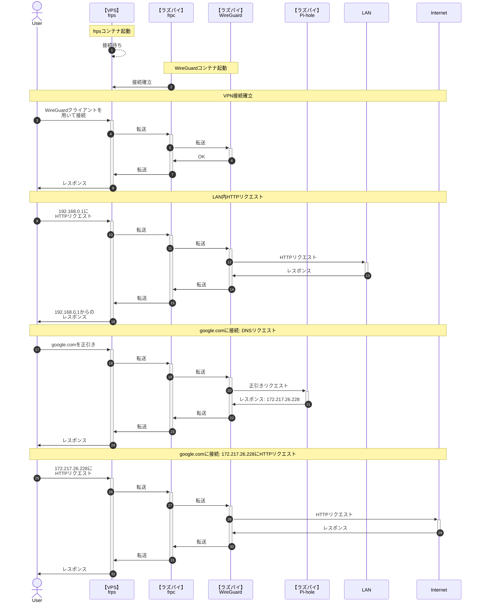

Raspberry Pi 4 model B で VPN アプリケーションである [WireGuard](https://www.wireguard.com/) を立て、[ConoHa VPS](https://www.conoha.jp/vps/) を経由して VPN 環境を構築します。

**自宅ルータのポートを開けずに** 自宅外から自宅内のサーバやパソコンにアクセスしたい、フリー Wi-Fi でもある程度安全に通信できる環境を作りたいと思い構築しています。

:::message
もともと [自分のメモサイト](https://memo.tomacheese.com) に上げようと思っていた内容を途中で持ってきたので、わかりにくい部分があったらすみません。  
また筆者には独学で学んだある程度のネットワーク知識しかなく、執筆した内容が正しいとは限りませんので他の記事や書籍もご覧ください。
:::

## 期待する結果

最終的に、以下のように動作するよう構成します。



## 環境

Raspberry Pi と VPS 間のポートフォワーディングに [fatedier/frp](https://github.com/fatedier/frp) を利用します。  
そのうえで、Docker Hub にあるもののうち **ユーザー数がある程度いて**、**GitHub Actions などで fatedier/frp のアップデートに追従しているもの** として [snowdreamtech/frp](https://github.com/snowdreamtech/frp) を選定しています。

:::message alert
Pi-hole と frp の利用には Docker を利用していますが、WireGuard は Docker 内で動作させません。また、PiVPN を利用しません。  
[linuxserver/wireguard](https://hub.docker.com/r/linuxserver/wireguard) を試したのですが、接続後 1 分程経過したタイミングでコンテナ内から LAN への通信がタイムアウトするようになりやめました。  
PiVPN を利用しない理由は途中のネットワークデバイス選択画面で Docker ネットワークが大量に表示され進めなくなったからです。

Raspberry Pi のブートストレージとして SD カードを利用している場合、SD カード故障による設定および鍵の紛失を防ぐため `/etc/wireguard` を HDD など別のストレージへのシンボリックリンクにするなど対策を取ってください。この記事では解説しません。
:::

もちろん、frp や Pi-hole を Docker で構築せずホスト OS にインストールしてもかまいません。  
WireGuard では Peer to Peer で双方がサーバにもクライアントにもなりうるので、ピア（Peer）と書くのが正しいのですがこの記事ではっきりとサーバ・クライアントが存在するので、「クライアント」と表記します。

- Raspberry Pi 4 model B
  - Raspberry Pi OS 64bit (Bullseye)
  - WireGuard 1.0.20210223-1
  - [snowdreamtech/frps](https://hub.docker.com/r/snowdreamtech/frps) 0.47.0
  - [pi-hole/pi-hole](https://hub.docker.com/r/pi-hole/pi-hole) 2023.02.2
  - Ethernet の NIC として `eth0` を利用
  - 各クライアントに割り振る IP として `172.16.0.x` を使用
  - WireGuard のサーバ IP として `172.16.0.254` を使用
- ConoHa VPS
  - 512 MB プラン
  - Ubuntu 20.04.5 LTS
  - [snowdreamtech/frpc](https://hub.docker.com/r/snowdreamtech/frpc) 0.47.0

## 作業

1. frps の構築
2. WireGuard のインストール
3. frpc の構築
4. Pi-hole の構築

### 1. frps の構築

まず始めに、VPS 側の frp サーバソフトウェアである frps のインストール作業をします。

VPS 上の任意の場所に以下の `compose.yaml` を作成します。

```yaml
services:
  frps:
    image: snowdreamtech/frps
    container_name: frps
    volumes:
      - ./frps.ini:/etc/frp/frps.ini
    ports:
      - 7000:7000
      - 12345:12345/udp
    restart: always
```

その後、`compose.yaml` を置いた同じディレクトリに `frps.ini` を作成し以下を設定します。

```ini
[common]
bind_port = 7000
token = "任意の文字列"
```

`token` はポートフォワーディング時の認証トークンとなるので、固有のある程度長い推測不能な文字列にしてください。

設定を終えたら、`docker compose up --build -d` で立ち上げます。  
`7000` ポートの開放も忘れずに。

:::message
最小のコード量で動作するように書いているので、`7000` 番ポート以外への変更作業や frps のダッシュボードの設定などは記述していません。必要に応じて実施してください。
:::

### 2. WireGuard のインストール

VPN サーバとなる WireGuard を Raspberry Pi 4 model B にインストールします。

WireGuard のインストールでは、以下の手順を踏んでいきます。

1. `sysctl` の設定
2. APT で WireGuard をインストール
3. サーバサイド鍵ペアの作成
4. WireGuard の設定ファイル作成
5. クライアントに配布する接続設定ファイルの作成
6. WireGuard のクライアント設定を更新
7. WireGuard の起動

このうち、5, 6, 7 はクライアントを追加するごとに実施するのでシェルスクリプトで再利用可能にします。（`クライアント追加用のシェルスクリプト作成` にセクションをまとめます）

#### sysctl の設定

追加設定をしない限り、異なる NIC 間でのパケットのやりとりができません。WireGuard は `wg0` などの NIC を追加するので、これと `eth0` 間でパケット転送ができない場合 VPN をつないでも LAN ネットワークやインターネットと通信できません。  
（という理解なのですが、間違ってたらすみません）

というわけで、IP 転送（フォワーディング）を有効にするため sysctl を編集します。  
お好みのエディタで `/etc/sysctl.conf` を開き、末尾に以下を追記し保存します。

```ini
net.ipv4.ip_forward=1
```

すでに `net.ipv4.ip_forward` に関する記述がある場合は当該行をコメントアウトするなどしてください。

その後、編集した内容を反映するため以下のコマンドを実行します。

```shell
sudo sysctl -p
```

#### APT で WireGuard をインストール

以下のコマンドを実行し、WireGuard をインストールします。

```shell
sudo apt update
sudo apt install wireguard
```

クライアントに接続設定を追加する際、QR コードで読み込めるようにする場合は `qrencode` もインストールしておきましょう。

```shell
sudo apt install qrencode
```

#### サーバサイド鍵ペアの作成

サーバに保管する鍵ペア（秘密鍵と公開鍵）を作成します。

:::message
この記事では意図的に「サーバ」や「クライアント」など親子関係を意味する言葉を利用しているので余計にわかりにくいのですが、WireGuard は Peer to Peer なので双方を認証するために双方それぞれで公開鍵・秘密鍵を生成し双方の相手に公開鍵を渡す必要があります。
:::

以下のコマンドで作成します。作成した鍵は `/etc/wireguard/server-*.key` に保存し、所有者のみ読み書き可にします。

```shell
sudo wg genkey | sudo tee /etc/wireguard/server-private.key
sudo cat /etc/wireguard/server-private.key | wg pubkey | sudo tee /etc/wireguard/server-public.key
sudo chmod -v 600 /etc/wireguard/server-*.key
```

#### WireGuard の設定ファイル作成

WireGuard の設定ファイルを `/etc/wireguard/wg0.conf` に作成します。

```shell
cat << EOF | sudo tee /etc/wireguard/wg0.conf
[Interface]
Address = 172.16.0.254
ListenPort = 51820
PrivateKey = $(sudo cat /etc/wireguard/server-private.key)
PostUp = iptables -A FORWARD -i %i -j ACCEPT; iptables -A FORWARD -o %i -j ACCEPT; iptables -t nat -A POSTROUTING -o eth+ -j MASQUERADE
PostDown = iptables -D FORWARD -i %i -j ACCEPT; iptables -D FORWARD -o %i -j ACCEPT; iptables -t nat -D POSTROUTING -o eth+ -j MASQUERADE
EOF
```

`%i` には WireGuard の NIC 名が自動で置き換わります。この場合は `wg0` です。

#### クライアント追加用のシェルスクリプト作成

クライアントの鍵ペア（秘密鍵と公開鍵）を作成します。また、セキュリティ向上を目的に事前共有鍵（PSK, Pre-Shared Key）も作成します。

:::message
事前共有鍵については、オプションではありますがこれがあることにより将来的に量子コンピュータが実用化された場合に、公開鍵暗号が解かれても事前共有鍵によって暗号化されているので問題ない…という点で「セキュリティ向上」が見込めるようです。
:::

作成にあたり、この作業はクライアントを追加するごとに実施するのでシェルスクリプトとして繰り返し実行可能にします。  
DNS の IP アドレスはとりあえずルータの IP アドレスを指定しておきましょう。Pi-hole を構築したあとで変更します。

@[gist](https://gist.github.com/book000/18482b52881ac1aec07f72ffcab9574d?file=wireguard-add-client.sh)

`ENDPOINT` と `DNS` については適宜修正してください。

このスクリプトを実行すると、`Please input client name:` と質問され、適当なクライアント名（端末名など）を入力し Enter を押すと各種キーが生成され接続設定ファイルが以下のように生成されます。


### 3. frpc の構築

### 4. Pi-hole の構築

## クライアントの設定

### iOS

### Android

### Windows

## トラブルシューティング
